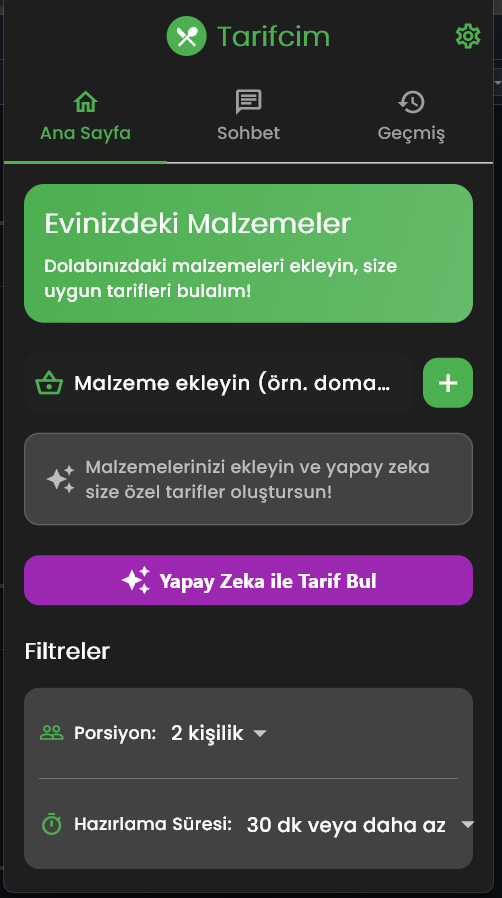
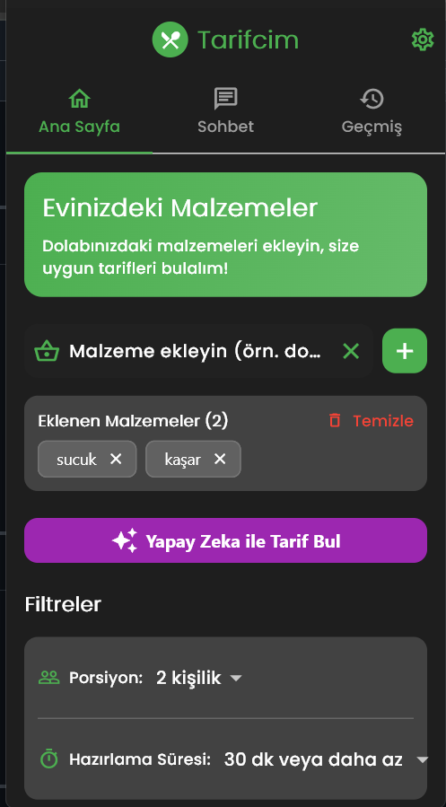
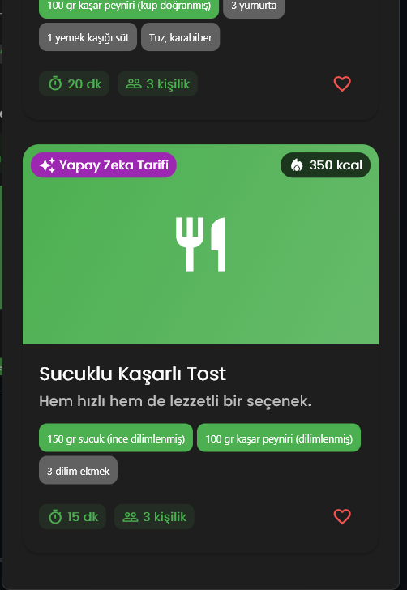
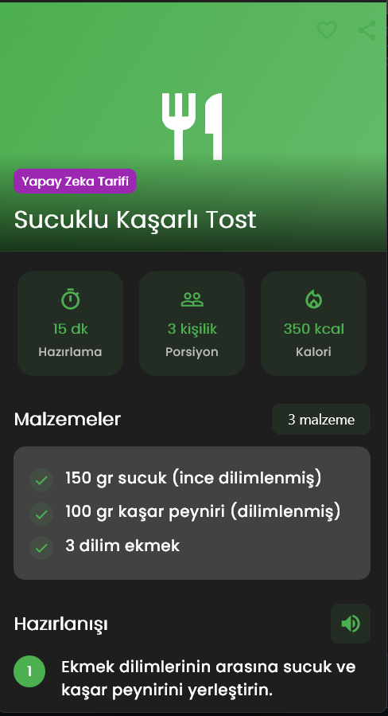
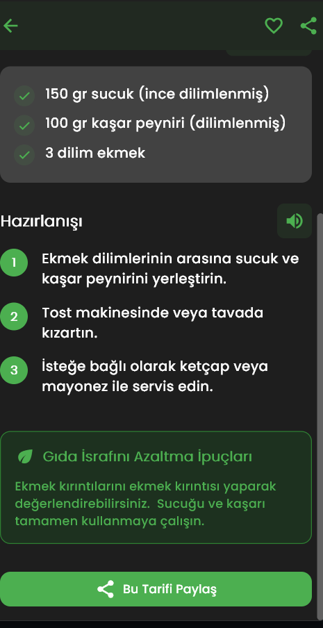
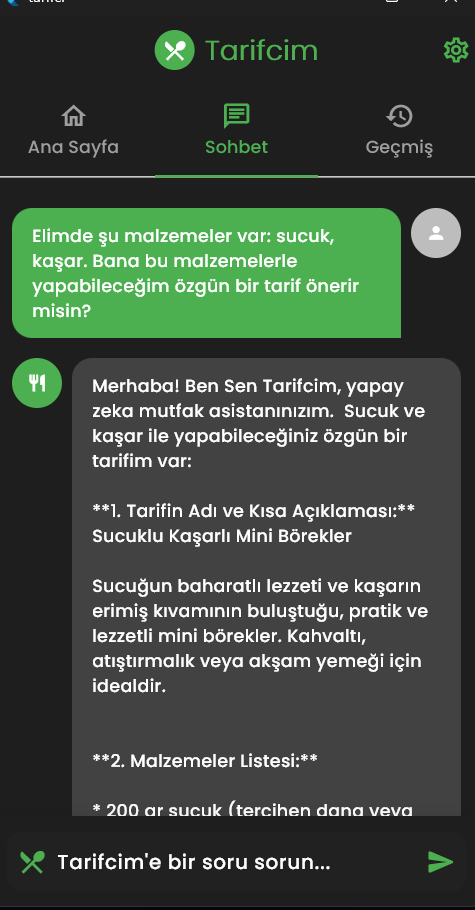
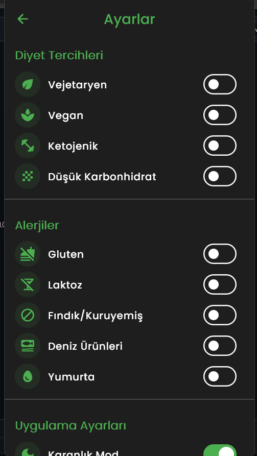
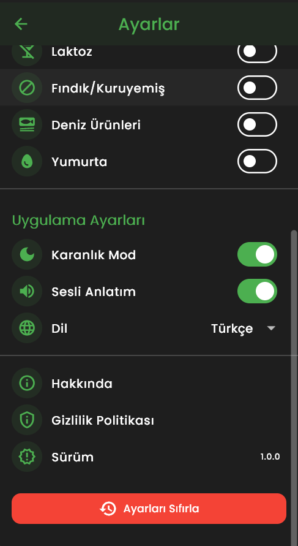

# 🧑‍🍳 Tarifcim - Yapay Zeka Destekli Tarif Öneri Uygulaması

**Tarifcim**, evdeki mevcut malzemelere göre kişiselleştirilmiş yemek tarifleri öneren yapay zeka destekli bir mobil uygulamadır. Kullanıcıların ellerindeki malzemeleri en verimli şekilde değerlendirmelerine yardımcı olur, gıda israfını azaltır ve beslenme tercihlerine uygun tarifler sunar.

---

## 📱 Özellikler

### 🥕 Malzeme Bazlı Tarif Önerileri
- Evde bulunan malzemelere göre özgün tarifler.
- Malzemelerin maksimum düzeyde değerlendirilmesi.

### 🍽️ Diyet ve Alerji Filtreleri
- Vejetaryen, vegan, ketojenik gibi diyet filtreleri.
- Alerjen malzeme uyarıları (gluten, laktoz, fındık vb.).
- Porsiyon ve hazırlama süresi özelleştirmesi.

### 🤖 Yapay Zeka Destekli Sohbet Asistanı
- Tarif önerisi, pişirme tekniği ve malzeme alternatifi sohbeti.
- Kullanıcıya özel sorulara gerçek zamanlı cevaplar.

### 📋 Detaylı Tarif Bilgisi
- Kalori, porsiyon ve hazırlık süresi bilgisi.
- Adım adım talimatlar.
- Gıda israfını azaltmaya yönelik ipuçları.

### 🌐 Erişilebilirlik
- Sesli tarif anlatımı.
- Koyu mod desteği.
- Türkçe ve İngilizce dil desteği.

---

## 🖼️ Uygulama Ekran Görüntüleri

| Ana Sayfa | Ana Sayfa (Scroll) | Ana Sayfa (Alt) |
|----------|--------------------|-----------------|
|  |  |  |

| Önerilen Tarifler | Tarif Ekranı | Tarif Ekranı(ALT) | Sohbet |
|-------------------|--------------|--------|
|  |  |  |  |

| Geçmiş | Ayarlar | Ayarlar(ALT) |
|--------|---------|
|  |  |  |

---

## 🧠 Yapay Zeka Entegrasyonu

Tarifcim, **Google Gemini 2.0 Flash** modelini kullanarak tarif üretir. Yapay zekanın çalışma mantığı:

1. **Veri Toplama**: Malzeme, diyet ve alerji bilgisi.
2. **Prompt Mühendisliği**: Bu bilgilerle yapay zekaya özel formatta sorgu gönderilir.
3. **Tarif Üretimi**: AI modeli özgün ve uygulanabilir tarif üretir.
4. **Sonuç İşleme**: JSON formatındaki çıktılar arayüzde görsel hale getirilir.
5. **Öğrenme ve Gelişim**: Kullanıcı geri bildirimlerine göre model davranışı iyileştirilir.

---

## 🛡️ Etik ve Gizlilik İlkeleri

- 🔒 **Veri Gizliliği**: Kullanıcı verileri yalnızca cihazda tutulur, paylaşılmaz.
- 📢 **Şeffaflık**: AI tarifleri açıkça “Yapay Zeka Tarifi” olarak etiketlenir.
- 🧬 **Erişilebilirlik ve Kapsayıcılık**: Her türlü diyet ve alerji ihtiyacına duyarlıdır.
- 🍃 **Gıda İsrafını Azaltma**: Sürdürülebilirlik odaklı tarif stratejisi.
- 🎛️ **Kullanıcı Kontrolü**: Filtre ve tercih ayarları tamamen kullanıcıya aittir.

---

## 🛠️ Kullanılan Teknolojiler

| Teknoloji         | Açıklama                                      |
|------------------|-----------------------------------------------|
| Flutter          | Mobil uygulama geliştirme (Android & iOS)     |
| Dart             | Uygulama dili ve mantığı                      |
| Provider         | Durum yönetimi için kullanılan state yönetimi |
| Gemini 2.0 Flash | Yapay zeka modeli (Google AI)                 |
| Material Design 3| Modern kullanıcı arayüzü tasarımı             |
| Flask            | Backend tarafında Gemini API’yi yöneten yapı |

---

## 🚀 Kurulum ve Kullanım

```bash
# Repoyu klonlayın
git clone https://github.com/kullanici-adi/tarifcim.git
cd tarifcim

# Flutter bağımlılıklarını yükleyin
flutter pub get

# Uygulamayı başlatın
flutter run
